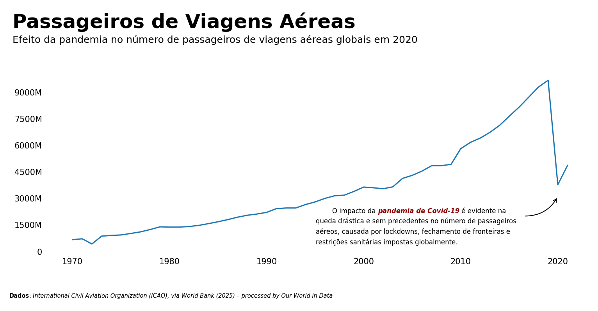

## **Passageiros Aéreos Globais**
Este notebook apresenta uma análise exploratória do volume de passageiros transportados por via aérea entre 1970 e 2021. Utilizando dados compilados pelo World Bank e processados pelo Our World in Data, o objetivo é visualizar tendências históricas e destacar eventos de grande impacto, como a pandemia de COVID-19. 
O projeto foi desenvolvido para praticar técnicas de storytelling com dados utilizando bibliotecas como `soaborn` e `matplotlib`.

Fonte de dados: 'Multiple sources compiled by World Bank (2024) – processed by Our World in Data. “Air passengers”. International Civil Aviation Organization (via World Bank), “World Development Indicators” [original data]. Retrieved January 23, 2025 from https://ourworldindata.org/grapher/air-passengers-carried


```python
# preparação do notebook
import sys
import os

sys.path.append(os.path.abspath('..'))

import warnings
import pandas as pd
import requests
import seaborn as sns
import matplotlib.pyplot as plt
from matplotlib.ticker import FuncFormatter
from matplotlib.ticker import MaxNLocator
from matplotlib.patches import FancyArrowPatch, Circle
from highlight_text import fig_text, ax_text
from src.utils import y_ticks_formatter

pd.set_option('display.float_format', lambda x: '%.2f' % x)
warnings.filterwarnings('ignore')
plt.rcParams["figure.dpi"] = 150

%load_ext autoreload
%autoreload 2
```

    The autoreload extension is already loaded. To reload it, use:
      %reload_ext autoreload
    

### **Leitura e Tratamento dos Dados**


```python
import pandas as pd
import requests

# leitura dos dados
prefix = "https://ourworldindata.org/grapher/air-passengers-carried"
df = pd.read_csv(
    f"{prefix}.csv?v=1&csvType=filtered&useColumnShortNames=true&tab=table&tableFilter=countries", 
    storage_options = {'User-Agent': 'Our World In Data data fetch/1.0'}
)

# leitura do metadata
metadata = requests.get(
    f"{prefix}.metadata.json?v=1&csvType=filtered&useColumnShortNames=true&tab=table&tableFilter=countries"
).json()
```


```python
metadata
```


    {'chart': {'title': 'Air passengers',
      'subtitle': 'Domestic and international passengers of airlines registered in the country. Passengers counted each time they travel.',
      'citation': 'International Civil Aviation Organization (ICAO), via World Bank (2025)',
      'originalChartUrl': 'https://ourworldindata.org/grapher/air-passengers-carried?tab=table&tableFilter=countries&v=1&csvType=filtered&useColumnShortNames=true',
      'selection': ['China', 'United States', 'European Union']},
     'columns': {'is_air_psgr': {'titleShort': 'Air transport, passengers carried',
       'titleLong': 'Air transport, passengers carried',
       'unit': '',
       'timespan': '1970-2021',
       'type': 'Numeric',
       'owidVariableId': 1008181,
       'shortName': 'is_air_psgr',
       'lastUpdated': '2025-01-24',
       'nextUpdate': '2026-01-24',
       'citationShort': 'International Civil Aviation Organization (ICAO), via World Bank (2025) – processed by Our World in Data',
       'citationLong': 'International Civil Aviation Organization (ICAO), via World Bank (2025) – processed by Our World in Data. “Air transport, passengers carried” [dataset]. International Civil Aviation Organization (ICAO), via World Bank, “World Development Indicators” [original data].',
       'fullMetadata': 'https://api.ourworldindata.org/v1/indicators/1008181.metadata.json'}},
     'dateDownloaded': '2025-06-26',
     'activeFilters': {'tab': 'table', 'tableFilter': 'countries'}}


```python
# visualizando dados
df.head()
```


<div>
<style scoped>
    .dataframe tbody tr th:only-of-type {
        vertical-align: middle;
    }

    .dataframe tbody tr th {
        vertical-align: top;
    }

    .dataframe thead th {
        text-align: left;
    }
</style>
<table border="0" class="dataframe">
  <thead>
    <tr style="text-align: left;">
      <th></th>
      <th>Entity</th>
      <th>Code</th>
      <th>Year</th>
      <th>is_air_psgr</th>
    </tr>
  </thead>
  <tbody>
    <tr>
      <th>0</th>
      <td>Afghanistan</td>
      <td>AFG</td>
      <td>1970</td>
      <td>84700.00</td>
    </tr>
    <tr>
      <th>1</th>
      <td>Afghanistan</td>
      <td>AFG</td>
      <td>1971</td>
      <td>97400.00</td>
    </tr>
    <tr>
      <th>2</th>
      <td>Afghanistan</td>
      <td>AFG</td>
      <td>1972</td>
      <td>104900.00</td>
    </tr>
    <tr>
      <th>3</th>
      <td>Afghanistan</td>
      <td>AFG</td>
      <td>1973</td>
      <td>96600.00</td>
    </tr>
    <tr>
      <th>4</th>
      <td>Afghanistan</td>
      <td>AFG</td>
      <td>1974</td>
      <td>96100.00</td>
    </tr>
  </tbody>
</table>
</div>


```python
# separando dados entre "countries", "income groups" e "Wolrd Bank Region"
worldbank_df = df[df['Entity'].str.contains('WB')]
income_df = df[df['Entity'].str.contains('income countries')]
countries_df = df.drop(worldbank_df.index.append(income_df.index))
```

### **Visualizações**

#### **Volume total de passageiros por ano e impacto da pandemia**


```python
# primeira visualização: volume total de passageiros por ano
grouped_df = (
    countries_df
    .groupby("Year", as_index=False)
    .agg({'is_air_psgr' : 'sum'})
)


fig, ax = plt.subplots(figsize=(12, 4))
ax.plot(grouped_df['Year'], grouped_df['is_air_psgr'])

# removendo bordas do gráfico
for spine in ax.spines.values():
    spine.set_visible(False)

# configurando eixos
ax.yaxis.set_major_formatter(FuncFormatter(y_ticks_formatter))
ax.yaxis.set_major_locator(MaxNLocator(nbins=7))
ax.tick_params(left=False, bottom=False)

# titulos e subtitulos
text = f"""
Passageiros de Viagens Aéreas
<Efeito da pandemia no número de passageiros de viagens aéreas globais em 2020>
"""
fig_text(
    x=0.075, 
    y=1.15,
    s=text, 
    color='black',
    fontweight='bold',
    fontsize=24,
    highlight_textprops=[
        {
            "fontsize": 12,
            "fontweight": 'normal'
        }
    ],
    ha='left'
)

# adicionando seta
arrow = FancyArrowPatch(
    posA=(2016.5, 2E9),  
    posB=(2020, 3.1E9),    
    arrowstyle='->', 
    connectionstyle="arc3,rad=.30",
    color='black',
    lw=1,
    mutation_scale=10
)
ax.add_patch(arrow)


# comentario pandemia
text = f"""
<Dados>: <{metadata['columns']['is_air_psgr']['citationShort']}>
"""
fig_text(
    x=0.07, 
    y=-0.05,
    s=text, 
    color='black',
    ha='left',
    fontsize=7,
    highlight_textprops=[
        {"fontweight": 'bold'},
        {"fontstyle": 'italic'},
    ],
)

# creditos
text = f"""
            O impacto da <pandemia de Covid-19> é evidente na 
    queda drástica e sem precedentes no número de passageiros
    aéreos, causada por lockdowns, fechamento de fronteiras e 
    restrições sanitárias impostas globalmente.
"""
fig_text(
    x=0.495, 
    y=0.315,
    s=text, 
    color='black',
    ha='left',
    fontsize=8,
    highlight_textprops=[
        {
            "fontstyle": 'italic', 
            "fontweight": 'bold', 
            "color": 'darkred'
        },
    ],
)

plt.show()
```


    

    


### **Próximos Passos**
- Adicionar visualização por World Bank Group, comparando volume total de passageiros, tendências e impacto da pandemia.

### **Fontes e Inspirações**
- Dados: https://ourworldindata.org/grapher/air-passengers-carried?tab=chart&country=~BRA#sources-and-processing
- Estilização: https://python-graph-gallery.com/web-stacked-charts/

