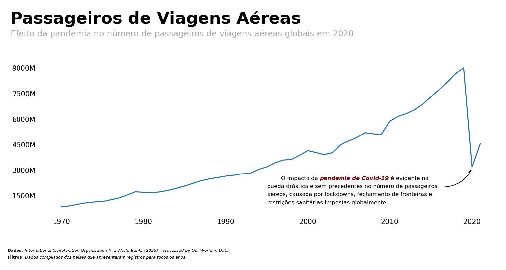

## **Passageiros Aéreos de 1970 a 2021**

Fonte: 'Multiple sources compiled by World Bank (2024) – processed by Our World in Data. “Air passengers” [dataset]. International Civil Aviation Organization (via World Bank), “World Development Indicators” [original data]. Retrieved January 23, 2025 from https://ourworldindata.org/grapher/air-passengers-carried


```python
# preparação do notebook
import sys
import os

sys.path.append(os.path.abspath('..'))

import warnings
import pandas as pd
import requests
import seaborn as sns
import matplotlib.pyplot as plt
from matplotlib.ticker import FuncFormatter
from matplotlib.ticker import MaxNLocator
from matplotlib.patches import FancyArrowPatch, Circle
from highlight_text import fig_text, ax_text
from src.utils import y_ticks_formatter

pd.set_option('display.float_format', lambda x: '%.2f' % x)
warnings.filterwarnings('ignore')
plt.rcParams["figure.dpi"] = 150

%load_ext autoreload
%autoreload 2
```

    The autoreload extension is already loaded. To reload it, use:
      %reload_ext autoreload
    

### **Leitura e Tratamento dos Dados**


```python
# leitura dos dados
df = pd.read_csv(
    "https://ourworldindata.org/grapher/air-passengers-carried.csv?v=1&csvType=full&useColumnShortNames=true", 
    storage_options={'User-Agent': 'Our World In Data data fetch/1.0'}
)

metadata = requests.get(
    "https://ourworldindata.org/grapher/air-passengers-carried.metadata.json?v=1&csvType=full&useColumnShortNames=true"
).json()
```


```python
metadata['columns']['is_air_psgr']
```


    {'titleShort': 'Air transport, passengers carried',
     'titleLong': 'Air transport, passengers carried',
     'unit': '',
     'timespan': '1970-2021',
     'type': 'Numeric',
     'owidVariableId': 1008181,
     'shortName': 'is_air_psgr',
     'lastUpdated': '2025-01-24',
     'nextUpdate': '2026-01-24',
     'citationShort': 'International Civil Aviation Organization (via World Bank) (2025) – processed by Our World in Data',
     'citationLong': 'International Civil Aviation Organization (via World Bank) (2025) – processed by Our World in Data. “Air transport, passengers carried” [dataset]. International Civil Aviation Organization (via World Bank), “World Development Indicators” [original data].',
     'fullMetadata': 'https://api.ourworldindata.org/v1/indicators/1008181.metadata.json'}


```python
# visualizando dados
df.head()
```


<div>
<style scoped>
    .dataframe tbody tr th:only-of-type {
        vertical-align: middle;
    }

    .dataframe tbody tr th {
        vertical-align: top;
    }

    .dataframe thead th {
        text-align: right;
    }
</style>
<table border="1" class="dataframe">
  <thead>
    <tr style="text-align: right;">
      <th></th>
      <th>Entity</th>
      <th>Code</th>
      <th>Year</th>
      <th>is_air_psgr</th>
    </tr>
  </thead>
  <tbody>
    <tr>
      <th>0</th>
      <td>Afghanistan</td>
      <td>AFG</td>
      <td>1970</td>
      <td>84700.00</td>
    </tr>
    <tr>
      <th>1</th>
      <td>Afghanistan</td>
      <td>AFG</td>
      <td>1971</td>
      <td>97400.00</td>
    </tr>
    <tr>
      <th>2</th>
      <td>Afghanistan</td>
      <td>AFG</td>
      <td>1972</td>
      <td>104900.00</td>
    </tr>
    <tr>
      <th>3</th>
      <td>Afghanistan</td>
      <td>AFG</td>
      <td>1973</td>
      <td>96600.00</td>
    </tr>
    <tr>
      <th>4</th>
      <td>Afghanistan</td>
      <td>AFG</td>
      <td>1974</td>
      <td>96100.00</td>
    </tr>
  </tbody>
</table>
</div>


```python
# verificando se o dataset contém dados dos anos para os países
# iremos utilizar para a visualização apenas os países com todos os anos
count = df.value_counts('Entity')
count
```


    Entity
    Lebanon           52
    Egypt             52
    Indonesia         52
    India             52
    Iceland           52
                      ..
    Gambia            10
    Eritrea            6
    American Samoa     5
    Aruba              2
    Guam               2
    Name: count, Length: 199, dtype: int64


```python
# filtrando apenas os países todos os anos registrados
df = df.loc[df['Entity'].isin(count[count == 52].index)]
df
```


<div>
<style scoped>
    .dataframe tbody tr th:only-of-type {
        vertical-align: middle;
    }

    .dataframe tbody tr th {
        vertical-align: top;
    }

    .dataframe thead th {
        text-align: right;
    }
</style>
<table border="1" class="dataframe">
  <thead>
    <tr style="text-align: right;">
      <th></th>
      <th>Entity</th>
      <th>Code</th>
      <th>Year</th>
      <th>is_air_psgr</th>
    </tr>
  </thead>
  <tbody>
    <tr>
      <th>70</th>
      <td>Algeria</td>
      <td>DZA</td>
      <td>1970</td>
      <td>563200.00</td>
    </tr>
    <tr>
      <th>71</th>
      <td>Algeria</td>
      <td>DZA</td>
      <td>1971</td>
      <td>714800.00</td>
    </tr>
    <tr>
      <th>72</th>
      <td>Algeria</td>
      <td>DZA</td>
      <td>1972</td>
      <td>843900.00</td>
    </tr>
    <tr>
      <th>73</th>
      <td>Algeria</td>
      <td>DZA</td>
      <td>1973</td>
      <td>1053600.00</td>
    </tr>
    <tr>
      <th>74</th>
      <td>Algeria</td>
      <td>DZA</td>
      <td>1974</td>
      <td>1252100.00</td>
    </tr>
    <tr>
      <th>...</th>
      <td>...</td>
      <td>...</td>
      <td>...</td>
      <td>...</td>
    </tr>
    <tr>
      <th>8066</th>
      <td>Venezuela</td>
      <td>VEN</td>
      <td>2017</td>
      <td>4209158.00</td>
    </tr>
    <tr>
      <th>8067</th>
      <td>Venezuela</td>
      <td>VEN</td>
      <td>2018</td>
      <td>2217407.00</td>
    </tr>
    <tr>
      <th>8068</th>
      <td>Venezuela</td>
      <td>VEN</td>
      <td>2019</td>
      <td>1516839.00</td>
    </tr>
    <tr>
      <th>8069</th>
      <td>Venezuela</td>
      <td>VEN</td>
      <td>2020</td>
      <td>283524.00</td>
    </tr>
    <tr>
      <th>8070</th>
      <td>Venezuela</td>
      <td>VEN</td>
      <td>2021</td>
      <td>265276.00</td>
    </tr>
  </tbody>
</table>
<p>4576 rows × 4 columns</p>
</div>


### **Visualização**


```python
# primeira visualização: volume total de passageiros por ano
grouped_df = (
    df
    .groupby("Year", as_index=False)
    .agg({'is_air_psgr' : 'sum'})
)
```


```python
fig, ax = plt.subplots(figsize=(12, 4))
ax.plot(grouped_df['Year'], grouped_df['is_air_psgr'])

# removendo bordas do gráfico
for spine in ax.spines.values():
    spine.set_visible(False)

# configurando eixos
ax.yaxis.set_major_formatter(FuncFormatter(y_ticks_formatter))
ax.yaxis.set_major_locator(MaxNLocator(nbins=7))
ax.tick_params(left=False, bottom=False)

# titulos e subtitulos
min_dt = df.Year.min()
max_dt = df.Year.max()

text = f"""
Passageiros de Viagens Aéreas
<Efeito da pandemia no número de passageiros de viagens aéreas globais em 2020>
"""
fig_text(
    x=0.075, 
    y=1.15,
    s=text, 
    color='black',
    fontweight='bold',
    fontsize=24,
    highlight_textprops=[
        {"fontsize": 12,
         "color": 'darkgrey',
         "fontweight": 'normal'}
    ],
    ha='left'
)

# adicionando seta
arrow = FancyArrowPatch(
    posA=(2016.5, 2E9),  
    posB=(2020, 3.1E9),    
    arrowstyle='->', 
    connectionstyle="arc3,rad=.30",
    color='black',
    lw=1,
    mutation_scale=10
)
ax.add_patch(arrow)


# comentario pandemia
text = f"""
<Dados>: <{metadata['columns']['is_air_psgr']['citationShort']}>
<Filtros>: <Dados compilados dos países que apresentaram registros para todos os anos.>
"""
fig_text(
    x=0.07, 
    y=-0.05,
    s=text, 
    color='black',
    ha='left',
    fontsize=6,
    highlight_textprops=[
        {"fontweight": 'bold'},
        {"fontstyle": 'italic'},
        {"fontweight": 'bold'},
        {"fontstyle": 'italic'},
    ],
)

# creditos
text = f"""
            O impacto da <pandemia de Covid-19> é evidente na 
    queda drástica e sem precedentes no número de passageiros
    aéreos, causada por lockdowns, fechamento de fronteiras e 
    restrições sanitárias impostas globalmente.
"""
fig_text(
    x=0.495, 
    y=0.315,
    s=text, 
    color='black',
    ha='left',
    fontsize=8,
    highlight_textprops=[
        {"fontstyle": 'italic', "fontweight": 'bold', 'color': 'darkred'},
    ],
)

plt.show()
```


    

    


### **Fontes e Inspirações**
Dados: https://ourworldindata.org/grapher/air-passengers-carried?tab=chart&country=~BRA#sources-and-processing \
Estilização: https://python-graph-gallery.com/web-stacked-charts/
